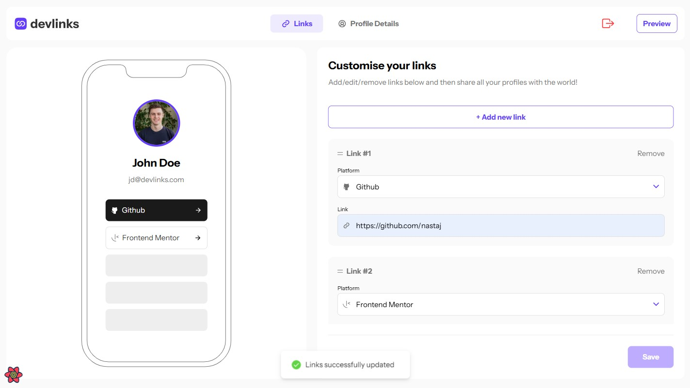

# Devlinks - Link-sharing app

This is a solution to the [Link-sharing app challenge on Frontend Mentor](https://www.frontendmentor.io/challenges/linksharing-app-Fbt7yweGsT).

## Table of contents

- [Devlinks - Link-sharing app](#devlinks---link-sharing-app)
  - [Table of contents](#table-of-contents)
  - [Overview](#overview)
    - [The challenge](#the-challenge)
    - [Screenshot](#screenshot)
    - [Links](#links)
    - [Built with](#built-with)
    - [Routes](#routes)
  - [Author](#author)

## Overview

### The challenge

Users should be able to:

- Receive validations if the links form is submitted without a URL or with the wrong URL pattern for the platform
- Add profile details like profile picture, first name, last name, and email
- Receive validations if the profile details form is saved with no first or last name
- Create, read, update, delete links and see previews in the mobile mockup
- Preview their devlinks profile and copy the link to their clipboard
- Drag and drop links to reorder them
- View the optimal layout for the interface depending on their device's screen size
- Create an account and log in (user authentication)
- Save details to a database
- See hover and focus states for all interactive elements on the page

### Screenshot

### Links

- Solution URL: [Frontend Mentor](https://your-solution-url.com)
- Live Site URL: [Netlify](https://nastaj-devlinks.netlify.app/editor)

### Built with

- Semantic HTML5 markup
- Flexbox
- Mobile-first workflow
- [React](https://reactjs.org/) - JS library
- [Tanstack Query](https://tanstack.com/query/latest) - Remote state management
- [React Hook Form](https://www.react-hook-form.com/) - Form management
- [DnD Kit](https://dndkit.com/) - Drag and Drop library
- [React Hot Toast](https://react-hot-toast.com/) - Toast messages
- [Tailwind CSS](https://tailwindcss.com/) - Styling
- [Supabase](https://supabase.com/) - Backend

### Routes

- /login
- /signup
- /editor
- /profile
- /preview

## Author

- Frontend Mentor - [@nastaj](https://www.frontendmentor.io/profile/nastaj)
